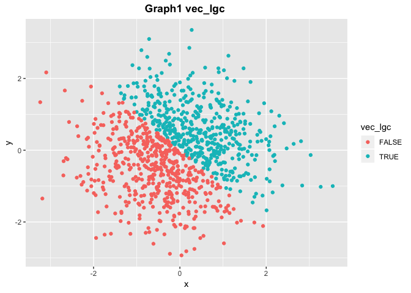
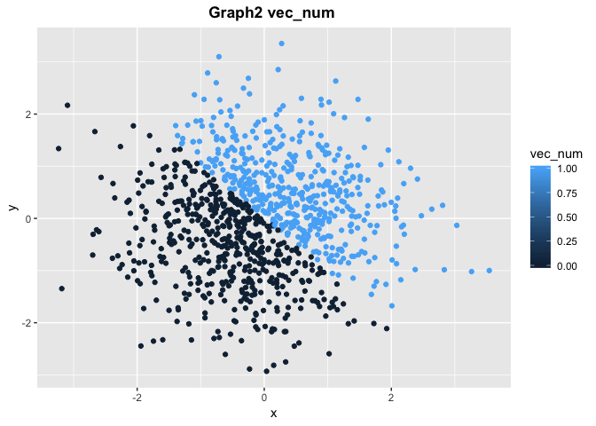
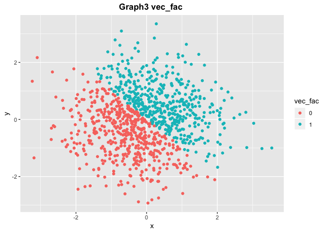

p8105\_hw1\_sj2921.Rmd
================
Shan Jiang
9/13/2018

# Problem 1

## Section 1.1

Here is a **Data Frame** to generate a sample of size 10 from a *uniform
distribution* of number ranges from 0-5, and a vector for choosing
elements which are greater than
    2:

``` r
library(tidyverse)
```

    ## ── Attaching packages ─────────────────────────────────────────────── tidyverse 1.2.1 ──

    ## ✔ ggplot2 3.0.0     ✔ purrr   0.2.5
    ## ✔ tibble  1.4.2     ✔ dplyr   0.7.6
    ## ✔ tidyr   0.8.1     ✔ stringr 1.3.1
    ## ✔ readr   1.1.1     ✔ forcats 0.3.0

    ## ── Conflicts ────────────────────────────────────────────────── tidyverse_conflicts() ──
    ## ✖ dplyr::filter() masks stats::filter()
    ## ✖ dplyr::lag()    masks stats::lag()

``` r
a = runif(10, min = 0, max = 5)
example_df = tibble(
  vec_numeric = a,
  vec_logical = c(a >= 2),
  vec_char = c("teacher","soldier", "doctor","kids","master","banker","hacker","servant ","accountant","statistician"),
  vec_factor = factor(c("Jan", "Feb", "Mar", "Apr", "May", "Jun", 
  "Jul", "Aug", "Sep", "Oct"))
)
```

The result of mean in each vector in data frame is shown below as an
attempt: the output of **numeric vector and logical vector** works while
for **character vector and factor vector**, it does not work. Since the
data type of **character vector and factor vector** cannot be used for
operations easily, so the mean of these two vectors are
    NAs.

``` r
mean(example_df$vec_numeric)
```

    ## [1] 3.031752

``` r
mean(example_df$vec_logical)
```

    ## [1] 0.8

``` r
mean(example_df$vec_char)
```

    ## Warning in mean.default(example_df$vec_char): argument is not numeric or
    ## logical: returning NA

    ## [1] NA

``` r
mean(example_df$vec_factor)
```

    ## Warning in mean.default(example_df$vec_factor): argument is not numeric or
    ## logical: returning NA

    ## [1] NA

## Section 1.3

Data Frame: Data Type coersion and Convertion

``` r
as.numeric(as.factor(example_df$vec_char))
```

    ##  [1] 10  8  3  5  6  2  4  7  1  9

``` r
as.numeric(as.character(example_df$vec_factor))
```

    ## Warning: NAs introduced by coercion

    ##  [1] NA NA NA NA NA NA NA NA NA NA

# Problem 2

``` r
set.seed(2018)
Scatter_df = tibble(
         x = rnorm(1000),
         y = rnorm(1000),
         vec_lgc = x + y > 0,
         vec_num = c(as.numeric(vec_lgc)),
         vec_fac = factor(c(as.numeric(vec_lgc)))
         )
```

  - The size of the dataset are that the rows are 1000 and the number of
    varibles are 5,
  - The mean of x is 0.0043214,
  - The median of x is 0.0315834,
  - The proportion of cases for which the logical vector is TRUE is 498
    /
1000

<!-- end list -->

``` r
ggplot(Scatter_df, aes(x = x, y = y, color = vec_lgc)) + labs(title = "Graph1 vec_lgc ") + theme(plot.title = element_text(face = "bold", hjust = 0.5)) + geom_point()
```

<!-- -->

``` r
ggsave("hw1_Scatter_1.png", width = 5,height = 6)
ggplot(Scatter_df, aes(x = x, y = y, color = vec_num)) + labs(title = "Graph2 vec_num ") + theme(plot.title = element_text(face = "bold", hjust = 0.5)) + geom_point()
```

<!-- -->

``` r
ggplot(Scatter_df, aes(x = x, y = y, color = vec_fac)) + labs(title = "Graph3 vec_fac ") + theme(plot.title = element_text(face = "bold", hjust = 0.5)) + geom_point()
```

<!-- -->
